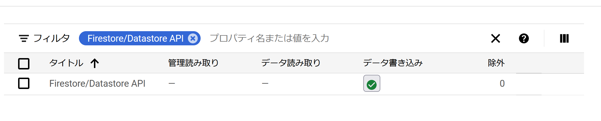

FireStoreのイベントは、[Eventarc](https://cloud.google.com/eventarc/docs)を用いることで他のサービス、例えばCloud Runなどをトリガーできます。

今回、Eventarcを用いてFireStoreのイベントをトリガーとしてCloud Runを呼び出してみることにします。

EventarcはAuditとPub/Subの両方から流し込むことができます。PubSubはCloud PubSubとして他のいろいろなところから流し込むことができ、AuditはFireStoreのイベント以外にもGoogle Cloudで起きるほぼすべてのAPI呼び出しをイベントとして流し込めます。

# 1. 取得したいイベントの監査ログを有効化する

最初にEventarcを有効化する監査ログの種類を指定し、有効化します。 `IAM権限管理 -> 監査ログ` で、 "Firestore/Datastore API" の "データ書き込み" を有効化します。



こうしておいて、ログエクスプローラからこのAPIが呼び出されていることを確認します。


`google.firestore.v1.Firestore.CreateDocument` が呼び出されていることをログで確認できました。

## 注意: 403が出る場合

ログエクスプローラに、EventArcからのリクエストがHTTP status 403とともに

```
The request was not authenticated. Either allow unauthenticated invocations or set the proper Authorization header. Read more at https://cloud.google.com/run/docs/securing/authenticating
```

というログが出る場合、

https://cloud.google.com/run/docs/authenticating/service-to-service

service-to-serviceの認証を追加します。

```
resource "google_project_iam_binding" "project" {
  project = var.project_id
  role    = "roles/eventarc.eventReceiver"

  members = [
    "serviceAccount:${data.google_project.project.number}-compute@developer.gserviceaccount.com"
  ]
}

resource "google_cloud_run_service_iam_member" "generator-allUsers" {
  service  = google_cloud_run_service.generator.name
  location = google_cloud_run_service.generator.location
  role     = "roles/run.invoker"
  member   = "allUsers"
}
```

`allUsers` じゃないほうがいいと思っているのですが、serviceAccountを制限すると403エラーが出てしまいました。ここは勉強不足でよく分かりませんでしたので宿題です。


# 2. Cloud Runを用意する

Eventarcによるトリガーは、CloudRunのインスタンスにHTTPとして送信されてきます。従って、Cloud RunにHTTPのエンドポイントを用意する必要があります。

普通にHTTPサーバーを実装してもよいのですが、Eventarcで送られてくるイベントは[CloudEvents](https://cloudevents.io/)の仕様に沿っています。そのため、このCloudEventsのライブラリを使用します。

## 2.1 CloudEventsの実装

[CloudEventsのGoライブラリ](https://github.com/cloudevents/sdk-go)がありますので、これを利用します。以下のサンプルのように `NewClientHTTP` を呼べば完了です。(o11yも追加できますが、それはまた別記事で)。ちなみにcloudeventsのパッケージは、子のモジュールを全部トップに展開する形式なので、トップだけimportすればよいです。

```
import (
  cloudevents "github.com/cloudevents/sdk-go/v2"
)

func main() {
  ctx := context.Background()

  c, err := cloudevents.NewClientHTTP()
  if err != nil {
    log.Fatalf("failed to create cloudevent client, %v", err)
  }
  // イベントを受け取る関数(この例ではreceive)をここで指定する
  if err := c.StartReceiver(ctx, receive); err != nil {
    log.Fatalf("cloudevent failed, %v", err)
  }
}
```

実装し終わったらデプロイし、FireStoreを書き込んでみます。すると、以下のようなJSONを受け取ることができるようになります。長いので適当にはしょっていますが、request以下をみることでどのresourceが更新されたか分かるかと思います。

```
 {
  "protoPayload": {
    "requestMetadata": {
      "callerSuppliedUserAgent": "tonic/0.5.2,gzip(gfe)",
    },
    "serviceName": "firestore.googleapis.com",
    "methodName": "google.firestore.v1.Firestore.CreateDocument",
    "resourceName": "projects/xxxxxxx/databases/(default)",
    "request": {
      "collectionId": "test",
      "documentId": "xxxxxxx",
      "document": {},
      "@type": "type.googleapis.com/google.firestore.v1.CreateDocumentRequest",
      "parent": "projects/xxxxx/databases/(default)/documents/test/test"
    },
    "metadata": {
      "keys": [
        "projects/xxxxxx/databases/(default)/documents/xxxxx/test/test/test/xxxxxx"
      ],
      "@type": "type.googleapis.com/google.cloud.audit.DatastoreServiceData"
    }
  },
    "timestamp": "2021-09-14T14:02:46.381314Z",
    "severity": "INFO",
    "receiveTimestamp": "2021-09-14T14:02:46.844514845Z"
  }
```

これは一般的なCloudEvent定義なので、[google-cloudevents-go](https://github.com/googleapis/google-cloudevents-go)を使用して、型変換してみます。FireStoreのイベントはAuditEventとして提供されているので、 `audit.LogEntryData` に`DataAs()` 関数を使ってdecodeします。

```
func recieve(event cloudevents.Event) {
	var e audit.LogEntryData
	if err := event.DataAs(&e); err != nil {
		log.Errorf("event parse failed")
	}
}
```

こうしておけば、 `*e.ProtoPayload.MethodName` などで中身を取り出せるようになります。

## 注意1: decode errorが出る

(追記: v0.2.0が出てこの問題は解決しました)

2021年9月現在、普通に実装すると以下のエラーが出ます。

```
json: cannot unmarshal string into Go struct field LogEntryData.severity of type audit.Severity 
```

これは、[このissue](https://github.com/googleapis/google-cloudevents-go/issues/68)とこれに付随するPRにて解決していますが、現時点ではリリースされていないので、以下のようにコミットをgo.modで指定します。

```
	github.com/googleapis/google-cloudevents-go v0.1.1-0.20210630234412-c5987988a6b2 // indirect
```

## 注意2: RequestやMetadataが空

(追記: v0.2.0が出てこの問題は解決しました)

[このissueで報告](https://github.com/googleapis/google-cloudevents-go/issues/77) していますが、`ProtoPayload` のRequestやMetadataが空になります。これは自動生成されているコードでは `fields` というプロパティが期待されているのに実際にはそうなっていないからです。(issue参照)

現時点ではこれらの情報を取るにはvendoringしておいて自分で Request の定義を書き換えないといけないです。


# まとめ

Google Cloudにおけるいろいろなイベントを取り込むことができるEventarcの紹介と、その実利用例として、Firestoreのドキュメント作成のイベントをCloudEvent形式で受信する例を紹介しました。Google Cloudで実行されるすべてのAPI呼び出しをhookできるようになるのはとても素晴らしいですね。

しかし、実世界のアプリケーションに適用しようとすると、じゃあ受け取る側がコケた時に後から再実行できるの？とか考えていくとぶっちゃけまだ微妙な気がします。再実行はPubSubに渡せばいいんですかね(まだ未検証)