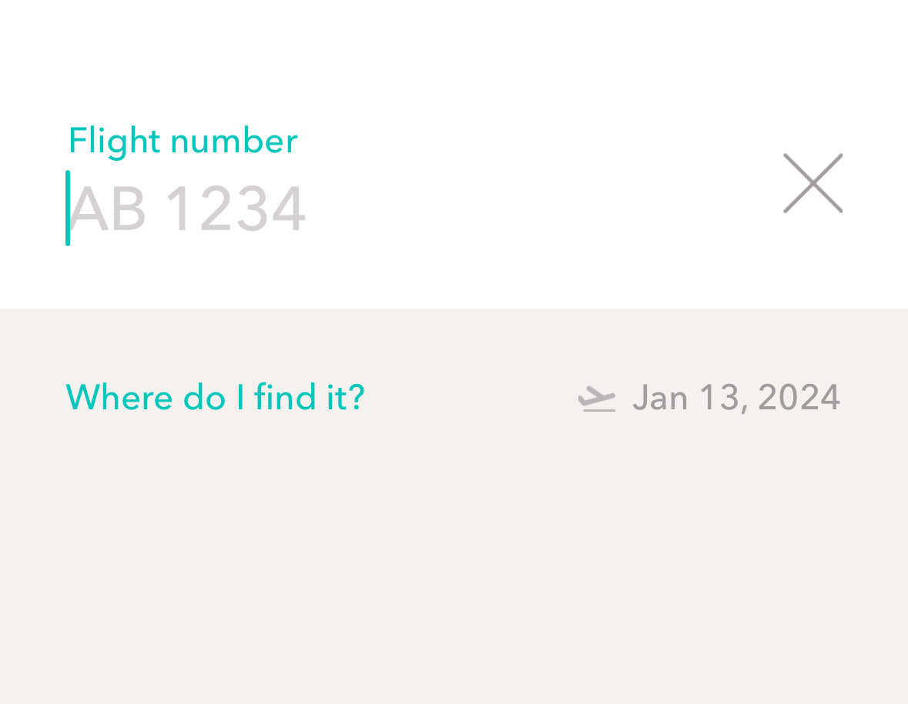
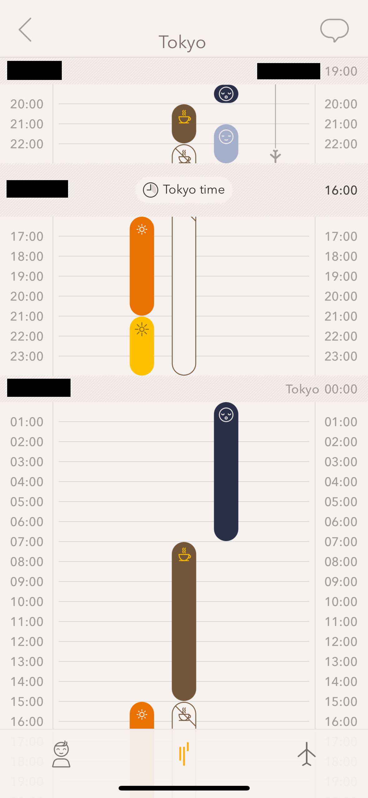

こんにちは、睡眠スヤスヤとり太郎です。[pyspa Advent Calendar 2023](https://adventar.org/calendars/8595)の15日目の記事として書かせて頂いています。
昨日の記事は、feizさんの[近況について](https://sizu.me/feiz/posts/ww639homhe66)です。

時は2023年も末...様々なオフラインイベントが開催されるようになってきており、人によっては海外出張に行く機会も
徐々に増えているご時世かと思います。本稿では、海外出張が多い人向けに、Timeshifter Jet Lag という時差ボケ解消アプリを用いて
時差ボケを最小化する方法について述べます。

なお、著者は Timeshiter Jet Lag の単なる1ユーザであり、アプリ作者との利害関係などは一切ありません。
その他、本稿から別のwebsiteに移動した際に、アフィリエイトや広告収入などを通じて著者(睡眠スヤスヤとり太郎)に対し一切の利益は生じないことを明記しておきます。

## Timeshiter とは 

[Timeshiter Jet Lag](https://www.timeshifter.com/the-jet-lag-app) は、モバイルアプリケーションであり、2023年12月15日時点では
[iOS版](https://apps.apple.com/us/app/timeshifter/id1380684374)と[Android版](https://play.google.com/store/apps/details?id=com.timeshifter.timeshifter)が公開されています。サブスクモデルを採用しており、利用料は年額3000JPYだったと思いますが、私が試したときは最初の一回は無料でした。

Websiteには以下のような記述があります:

```
It's time to replace the myths with real jet lag science
```

科学の力で、渡航先でも睡眠がスヤスヤとれそうですね。私にぴったりです。


## Timeshiter Jet Lag を使ってみた

たまたま出張に行く機会がありましたので、私が Timeshiter Jet Lag を利用した体験を具体的に記述してみたいと思います。
アプリの利用を開始すると、フライトの入力が求められます。

<!--  -->
 

また、うろ覚えですが、初回利用時には普段の就寝時間、起床時間、そして睡眠導入剤(メラトニン)を使用する習慣があるかという質問もあったかと思います。私は睡眠導入剤を利用していないので、そのように回答しました。

ひとたび入力を完了すると、フライト情報と時差を考慮した、あなたのための活動プランが生成されます。活動プランには、いつ寝るべきか、いつカフェインをとるべきかといった情報が表示されます。使ってみた感じですと、だいたい2-3日前からtimeshiftに向けたプランが生成されることが多いように思います。

 
<!--  -->

このプラン通りに活動すると...！主観ですが、時差ボケが大分軽くなります。とはいえ、移動後1-2日の出発地点の深夜などは眠くなったりもしましたが...これは睡眠不足によるものかと思います。睡眠スヤスヤとり太郎失格と言えるでしょう。

## Timeshiter Jet Lag が考慮してくれないもの

少なくとも、一人旅ではかなり良い感じに動作してくれました。一方で小さいお子様とご移動される際には、どうしてもアプリ通りに活動出来ないこともあるかと思います。その他、仕事の忙しさや、当日の体調などは考慮してくれず、生成されたプランに全力で従える前提のアプリとなっています。旅には例外はつきもの。柔軟に行きましょう。

## その他のtips

2023年になり、渡航に有用だと思った tips をまとめておきます:

- eSIM サービスを用いた安価な通信手段の確保: 5年前は海外渡航の際、現地における通信のために現地SIMを事前購入していたかと思います。現在はeSIM搭載端末が普及しているため、[airalo](https://www.airalo.com/)のようなeSIMを低価格で利用できるサービスを使うと出費を減らせます。
- [MASTER キートン](https://www.shogakukan.co.jp/books/volume/27944?sort=old)を読むことによる、危機管理能力の向上: 本書の主人公キートン先生が海外渡航したときの拉致され率は非常に高く、トラブル時があったときにどのように対処すべきかという想像力が喚起されます。例えば、本書を読むことで、飛行機着陸時に「もしかしたら胴体着陸するかもしれない！」というアイデアが想起され、足を保護するために毎回あぐら体勢にしたくなるでしょう。
- [Breaking Down オーディション](https://www.youtube.com/watch?v=NqPuOmaj_eo)を閲覧することによる、危機管理能力の向上: 滞在場所にかかわらず、いつ何時も暴力は向こうからやってきます。Breaking down 10 オーディション中には、[サップ西成選手に対しつかかったSATORU 選手に大阪陣営が殴りかかり、大変な乱闘騒ぎになっていました](https://www.youtube.com/watch?v=3-Mm0nOP4BI?t=1920)。我々ができること...それは逃げることです。何かあったときに即座に逃げることができるように、いつでも Breaking Down のオーディションを見て脳内シミュレーションをし、反応できるようにしておきましょう。

## まとめ

海外渡航が多い方向けに Timeshiter Jet Lag というアプリの紹介と、使ってみた感想を記述しました。私は薬を飲んだ瞬間に体調が良くなったと感じるプラセボ効果MAX民であるため、もしかしたら「NASA の宇宙飛行士も効くっていってるぜ！」というプラセボ効果がもたらした結果かもしれませんが、 個人的には良い感じです。もしよければ使ってみてください。明日はさくらんぼさんの「無」についてです。
